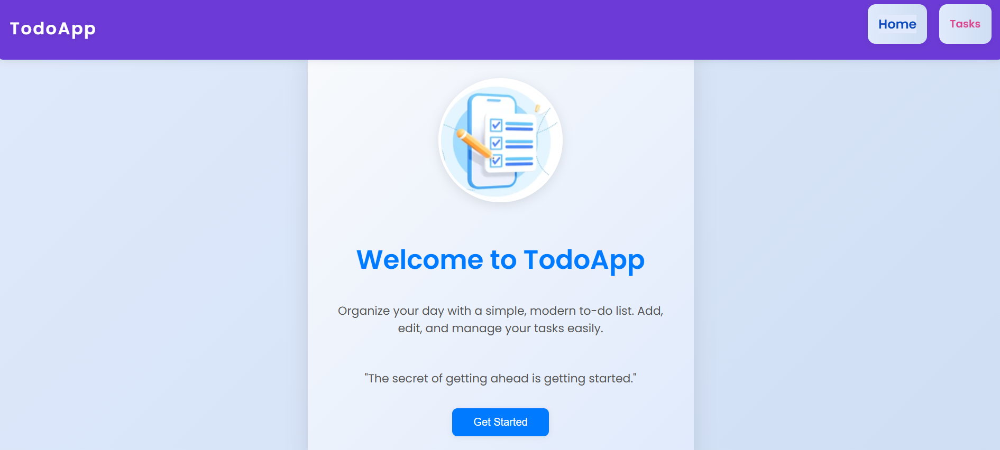
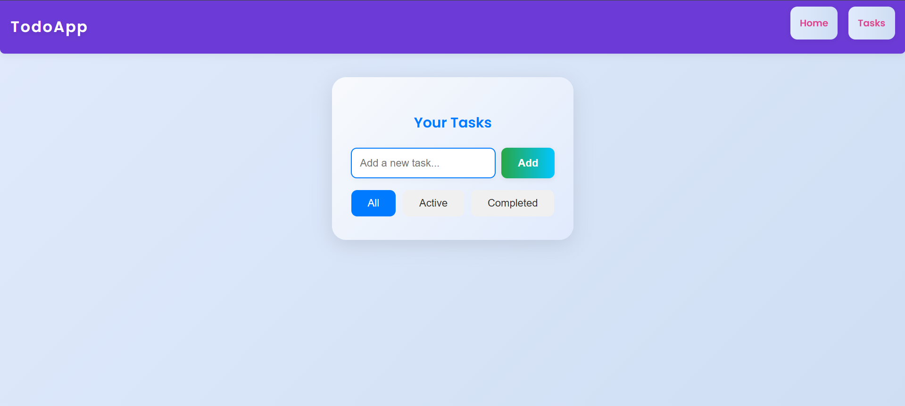
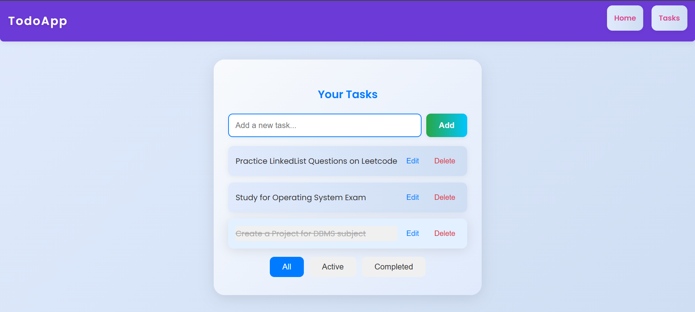
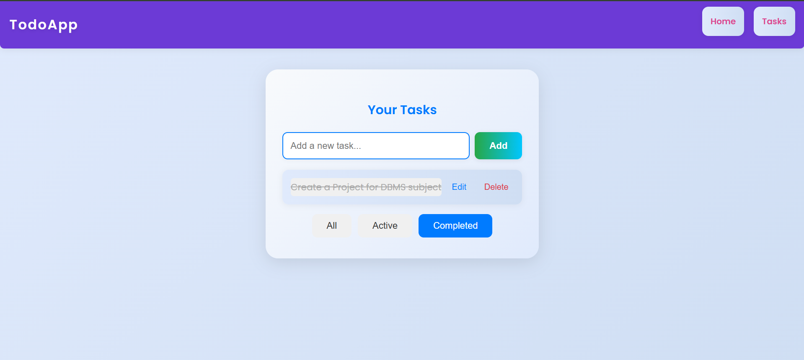

# ✅ TodoApp

A modern, responsive To-Do List web app built using **HTML**, **CSS**, and **Vanilla JavaScript**. This app allows users to add, edit, delete, and manage tasks with real-time filtering. Designed for simplicity and usability.

---

## 🚀 Features

- ➕ Add new tasks
- 📝 Edit tasks
- 🗑️ Delete tasks
- ✅ Mark as completed
- 🔍 Filter: All, Active, Completed
- 📱 Mobile-responsive design
- 🎨 Clean, colorful UI with smooth interactions
- ⚠️ Tasks are not stored persistently (no LocalStorage or database)

---

## 📸 Screenshots

### 🏠 Home Page

### ➕ Add Tasks

### 🗂️ Task List with Filters

### ✅ Completed Tasks

---

## 🛠️ Built With

- HTML5
- CSS3
- JavaScript (Vanilla)

---

## 📁 Folder Structure
'''text
TodoApp/
├── index.html
├── style.css
├── script.js
├── img.png
├── README.md
└── screenshots/
